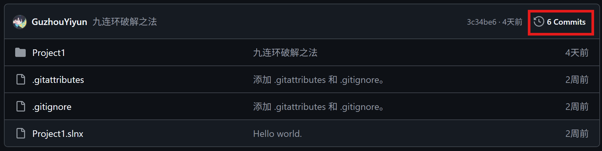

# Code Problems

个人刷题练习仓库：C++ 题解 + 解题心得记录。

## 仓库说明

- 使用 Visual Studio C++ 编写，主代码在 `Project1/源.cpp`
- 自带 `Project1/bits_stdc++.h` 头文件，补全 MSVC 缺少的 bits 头
- 部分题的解题思路与心得都写在对应提交的提交信息中

## 分支结构

- `main` — 其他地方看到或者是生活中看到的
- `洛谷` — 洛谷 OJ 的题目
- `码题集` — 码题集平台的题目